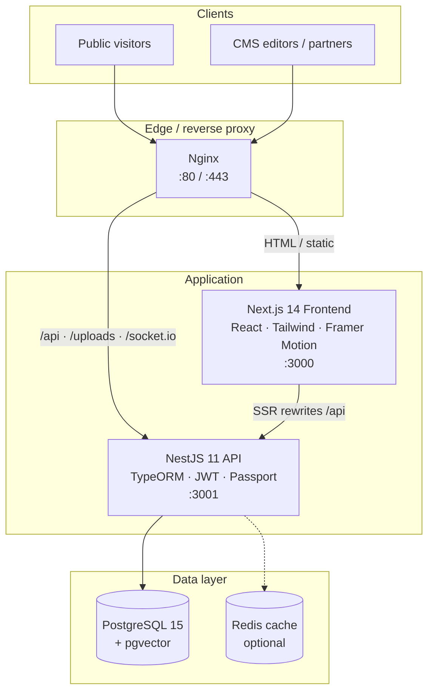
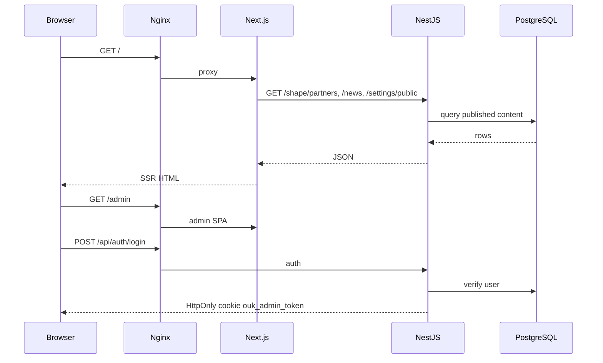

# SHAPE the Future

Erasmus+ **Grant Management & Dissemination Portal** for *Strengthening Higher Education for Smart Cities* — coordinated by the Open University of Kenya with partners across East Africa and Europe.

| Environment | URL |
|-------------|-----|
| **Website** | https://shape.ouk.ac.ke |
| **CMS / Admin** | https://shape.ouk.ac.ke/admin |

Stack heritage: [OUK-Websites](https://github.com/DevMwarabu/OUK-Websites). **Production deploy:** [DEPLOYMENT.md](./DEPLOYMENT.md).

---

## Architecture



### Request flow (production)



---

## Tech stack

| Layer | Technology |
|-------|------------|
| **Frontend** | Next.js 14 (App Router), React 18, Tailwind CSS, Framer Motion, next-intl |
| **Backend** | NestJS 11, TypeORM, Passport JWT, Swagger |
| **Database** | PostgreSQL 15 (pgvector image) |
| **Cache** | Redis (falls back to in-memory in local dev) |
| **CMS** | Custom `/admin` SPA |
| **Deploy** | Docker Compose + Nginx |

### Brand colours

| Token | Hex |
|-------|-----|
| Teal | `#037b90` |
| Gold / Coral | `#ff7f50` |
| White | `#ffffff` |

Fonts: **Inter** (body) · **Literata** (display headings)

---

## Repository layout

```
shapethefuture/
├── frontend/                 # Next.js public site + /admin CMS
├── backend/                  # NestJS API + TypeORM entities
│   └── src/shape/            # SHAPE domain (partners, WPs, events, KPIs…)
├── docs/                     # Deploy hygiene + edge/TLS notes
├── DEPLOYMENT.md             # Production cutover guide
├── docker-compose.yml        # Full stack (prod-oriented)
├── docker-compose.prod.yml   # Bake FE public env in image
├── docker-compose.dev.yml    # Local weak defaults (not for public hosts)
├── docker-compose.tls.yml    # HTTPS overlay
├── docker-compose.shape.yml  # Local Postgres (+ Redis) only
├── nginx.conf                # HTTP reverse proxy
├── nginx.ssl.example.conf    # TLS edge config (shape.ouk.ac.ke)
└── .env.example              # Template secrets (no real credentials)
```

---

## Local development

### 1. Start database

```bash
docker compose -f docker-compose.shape.yml up -d
```

Postgres is mapped to **localhost:5433** (avoids clashing with a local Postgres on 5432).

### 2. Configure env

```bash
cp .env.example .env
cp backend/.env.example backend/.env
cp frontend/.env.example frontend/.env.local
```

### 3. Install, seed, run

```bash
# API
cd backend && npm install && npm run start:dev

# Seed SHAPE content + admin user (once)
export SEED_ADMIN_EMAIL=admin@ouk.ac.ke
export SEED_ADMIN_PASSWORD='your-strong-local-password'
cd backend && npm run seed:shape

# Website
cd frontend && npm install && npm run dev
```

| Service | URL |
|---------|-----|
| Website | http://localhost:3000 |
| Admin CMS | http://localhost:3000/admin |
| API | http://localhost:3001 |
| API health | http://localhost:3001/health |

If an admin user already exists, seed can run without rotating the password (set `SEED_ADMIN_PASSWORD` only when creating or rotating).

---

## Public portal routes

| Path | Purpose |
|------|---------|
| `/` | Home — hero, stats, overview, news, WPs, partners |
| `/the-project` | Objectives, outcomes, funding, Erasmus+ |
| `/partners` | Nine partner institutions |
| `/work-packages` | WP1–WP8 with progress |
| `/workplan` | Activity timeline |
| `/events` | Event tracker |
| `/dashboard` | Grant progress KPIs |
| `/documents` | Document repository |
| `/news` | News & updates |
| `/sdlc` | Project development cycle |
| `/monitoring` | M&E + risk register |
| `/map` | Interactive partner map |
| `/media` | Press coverage + gallery |
| `/gallery` | Media gallery |
| `/accessibility` | Accessibility statement |
| `/contact` | Coordinator + contact form |

Legacy OUK academic/about routes are **fenced** (308 → `/the-project`) and disallowed in `robots.txt`.

Public pages fall back to built-in seed content if the API is empty or unreachable.

---

## CMS (`/admin`)

SHAPE content managers (under **SHAPE Project** in the sidebar):

- Homepage · Partners · Work packages · Events · Documents · Press  
- KPIs · Activities · Risks · SDLC · Contact inbox · News · Hero slides  

| Role | Scope |
|------|--------|
| Super Admin / consortium coordinator | Full CMS including KPIs, risks, SDLC, press, contact inbox |
| Partner institution | Scoped partners / WPs / events / documents / activities |

New records default to **draft** until published.

---

## Key API surfaces

**Public**

- `GET /shape/partners` · `/work-packages` · `/events` · `/documents` · `/press`
- `GET /shape/activities` · `/kpis` · `/risks` · `/sdlc` · `/dashboard`
- `POST /shape/contact`
- `GET /news` · `GET /settings/public` · `GET /health`

**Admin** (JWT cookie `ouk_admin_token`)

- `GET /shape/*/admin` + `POST` / `PATCH` / `DELETE` mutations  
- `POST /auth/login` · `GET /auth/me`

---

## Tests & CI

```bash
# Backend Shape unit tests
cd backend && npx jest src/shape --runInBand

# Frontend
cd frontend && npm run typecheck
cd frontend && npm run build   # eslint ignored during build; npm run lint remains available
cd frontend && npm run test:a11y
cd frontend && npm run test:smoke

# Deploy pre-flight
node scripts/check-deploy-hygiene.mjs
```

---

## Production (short)

Full guide: **[DEPLOYMENT.md](./DEPLOYMENT.md)**.

```bash
cp .env.example .env   # strong POSTGRES_PASSWORD + JWT_SECRET
node scripts/check-deploy-hygiene.mjs
docker compose -f docker-compose.yml -f docker-compose.prod.yml up -d --build
```

- `TYPEORM_SYNCHRONIZE=false` in production; use migrations or a reconciled dump  
- Never commit `.env` files or database dumps  
- TLS: add `docker-compose.tls.yml` after certs for `shape.ouk.ac.ke`  

---

## Partners (consortium)

Open University of Kenya · Moi University · Makerere University · Kampala International University · Mogadishu University · Red Sea University · Otto von Guericke University · University of Tartu · Lithuanian University of Health Sciences

---

## License / funding

Co-funded by the **Erasmus+** programme of the European Union. Views and opinions expressed are those of the authors only and do not necessarily reflect those of the European Union or EACEA.
